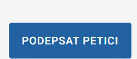
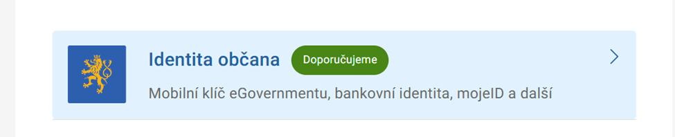
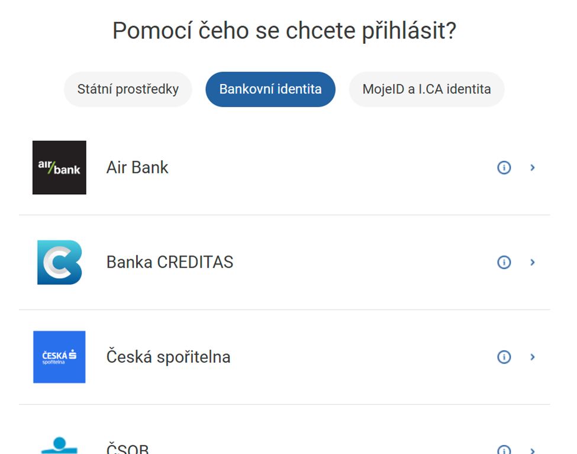
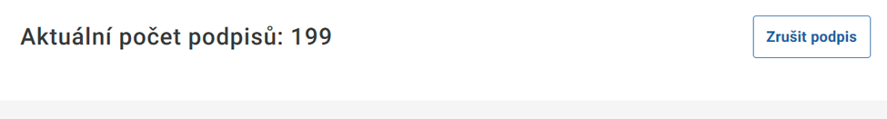
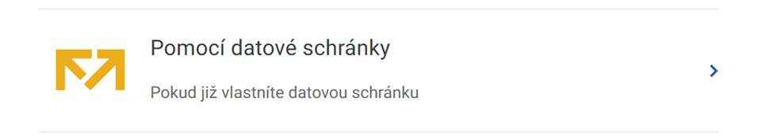
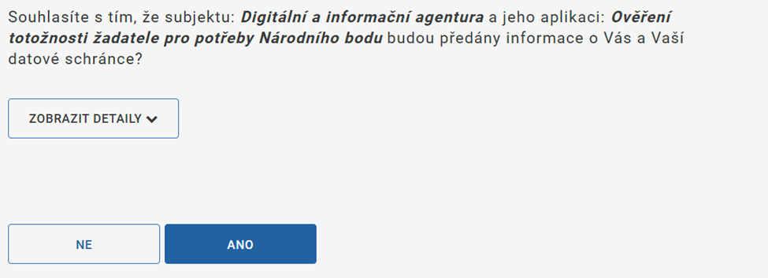
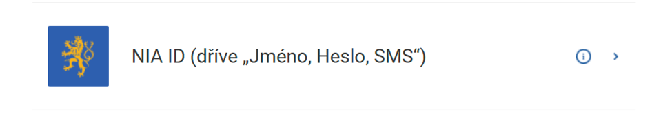
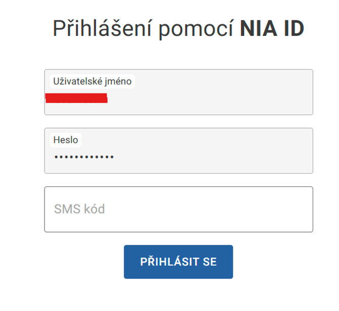

## How to sign a petition on gov.cz

Click “Sign the petition”:

.

Then there are two options: sign via bank ID, or via NIA, which is easy to do if you have databox (datova schranka).

## Option 1, sign via bank ID:
Choose the type of login "identita občana":
.

Next in the vertical list select "bankovni identita" and your bank:
.

And follow the instructions on the screen. Depending on the bank, you are required to enter your identifier (e.g. phone number or rodne čislo) and confirm your login in the banking app on your phone. 

For some banks (e.g. Raiffeisen) it is necessary to pre-authorize the use of bank ID in the settings of the user profile in the mobile app.

After all this, you should be allowed to enter the Portál občana. If you are redirected to the main page of the portal, follow the link to the petition again and click “Sign” again.

Make sure that your signature is accepted - the number of signatories should increase and the “Cancel signature” button should appear. You don't need to click on it :)

## Option 2, sign via NIA if you have a databox (datova schranka).
Open the address https://www.identitaobcana.cz/registrace/nia-id in your browser

Select “With datova schranka” from the list:

Log into your databox and give a consent:

.

After that, you'll be taken back to the identitaobcana site, where you have to do the rest of the steps - confirm your phone number and/or email. Eventually you'll have a username-password pair for your NIA ID.

Go back to the gov.cz website with the petition, click “Sign”.

Select the "identita občana" login type:

And then item NIA ID:

Enter your username and password for your NIA ID. You'll get a code from a text message, you need to enter that in the box too:

After all this, you should be allowed to login into "Portál občana". If you're taken to the main portal page, follow the link to the petition again and click “Sign” again.
Make sure that your signature is accepted - the number of signatories should increase and the “Cancel signature” button should appear. You should not click on it :)

